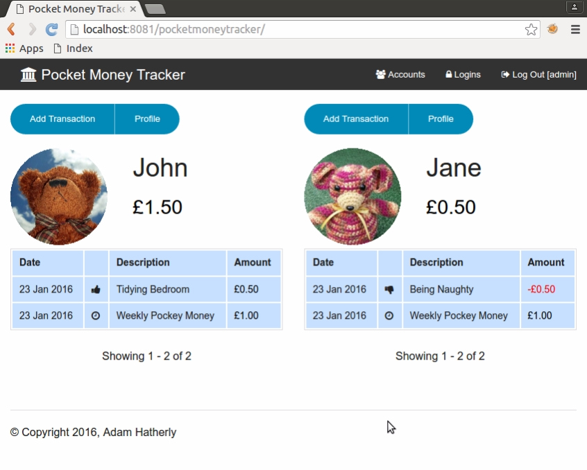

Pocket Money Tracker
====================



This is a simple web-based application to allow you to keep track of pocket money for any number of children. It works a bit like a bank, with individual accounts that are credited with a specified amount each week (on the day you specify). As an administrative user you can also add money as a reward for good behaviour, and subtract money for bad behaviour. If you give your child cash from their pocket money "account" you can record that as a "withdrawal", and their balance will be reduced accordingly.

The children can also be given logins, and they can use these to view their balance and transactions, and they can even update their own profile picture!

This software is open source under the Apache 2.0 license.

Installation
============

First, clone the repository to a local directory:

```
git clone https://github.com/ahatherly/pocketmoneytracker.git
```

Then, use maven to build a war file:

```
mvn install
```

Now, deploy the war file into a servlet container (e.g. tomcat).
In order for the weekly pocket money payments to be paid automatically, you will need to schedule a cron job (or equivalent windows task) to access this URL: http://<base-url>/pocketmoneytracker/scheduler

An example CRON line would be:

```
0 2 * * * /usr/bin/wget http://127.0.0.1:8080/pocketmoneytracker/scheduler > /dev/null 2>&1
```

Database Setup
==============

You will need to have mongodb installed to hold the data. By default it will assume mongodb is running on localhost, and the first time you access the application a new databse called "pocketmoneytracker" will be added. You can change the name of the database, as well as the connection host, port etc for mongodb by editing the config.properties file in the src/main/resources directory before running the maven build.


Running in Docker
=================

Installing in Docker is also straight-forward - first pull and run a mongodb container:

```
docker run --name mongodb --restart=always -v /media/FreeAgent_Drive/mongodb:/data/db -d mongo
```

You will need to alter the config.properties file to set the database hostname to this container name - from the root of the checked out git project, type:

```
sed -i 's/host=127.0.0.1/host=mongodb/' src/main/resources/config.properties
```

Now, build the code using Maven as normal (skipping tests as these will try to connect to the database, which will fail):

```
mvn install -DskipTests
```

And build the docker container with the built war file:

```
docker build -t pocketmoneytracker .
```

Finally, start the container linked to the mongodb container, and with a port exposed for you to access it on (in this case 8088):

```
docker run --name pocketmoneytracker --restart=always -p 8088:8080 --link mongodb:mongodb -d pocketmoneytracker
```

You should now be able to test it out by visiting: http://localhost:8088/pocketmoneytracker/

